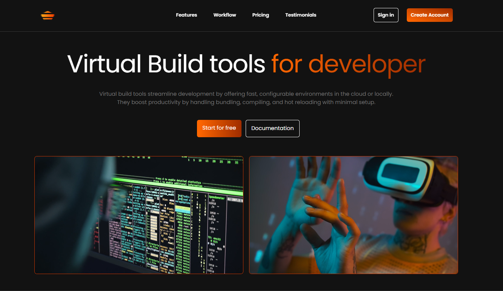

# VR Code Build App - Landing Page

A modern and responsive landing page for a VR code build tool, developed using **React** and **Tailwind CSS**. This project showcases the features and capabilities of a futuristic VR developer toolkit.

## 🚀 Demo

[Live Demo](https://react-vr-devtools-landing.vercel.app/)

## 🖼️ Screenshot

## 🛠️ Tech Stack

- **React** – UI library
- **Tailwind CSS** – Utility-first CSS framework
- **Vite / CRA** – (Specify which you are using)
- **Deployment** – Netlify / Vercel / GitHub Pages

## 🧩 Features

- Fully responsive design
- Smooth animations and transitions
- Mobile-first layout
- Clean and minimal UI
- Built for scalability and performance
